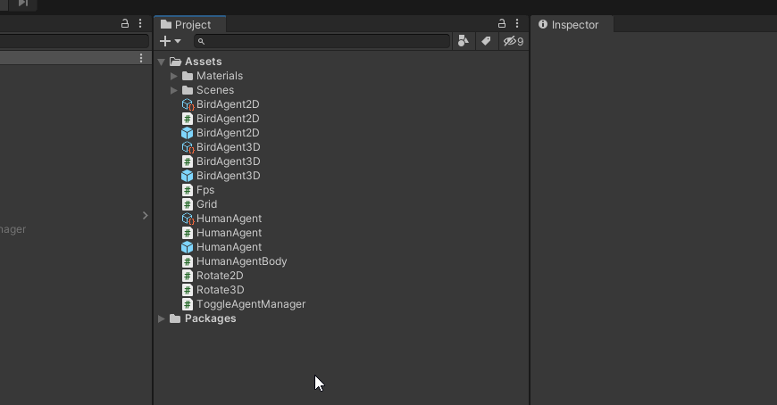
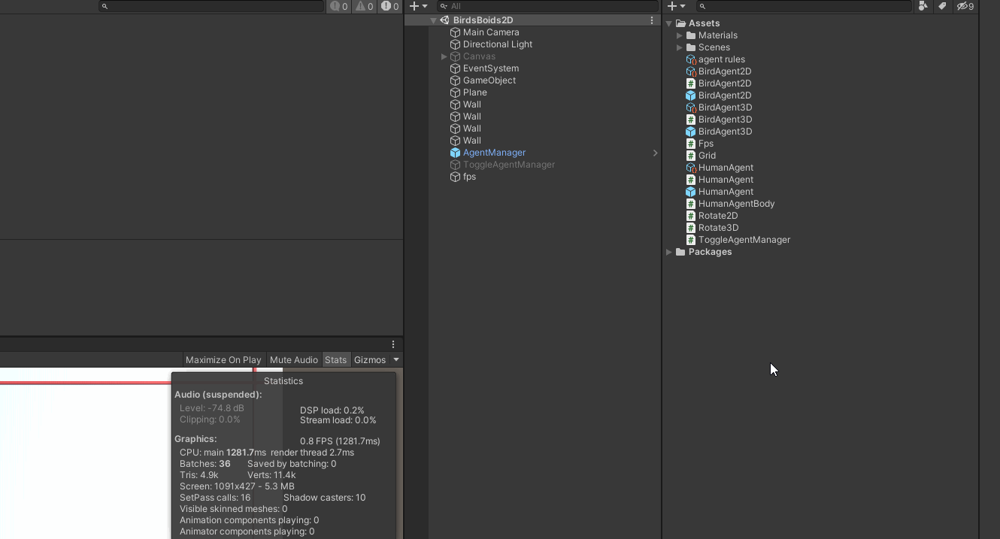
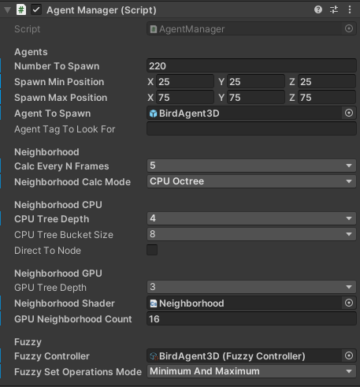

# Fuzzy Simulation plugin for Unity

Fuzzy logic based framework for Unity game engine that offers visual programming of collective behaviour.

## Installation

Window -> Package Manager -> Add package from git URL -> write in the URL of this repository: https://github.com/simondimc/unity-fuzzy-simulation.git

You can also clone or download the repository and add the package from disk.

## Usage

### Fuzzy Controller

Create a Fuzzy Controller that will hold the behaviour rules for your agent.



### Editor

Open the Fuzzy Controller and define the behaviour rules in the Editor.



### In code

Reference the Fuzzy Controller inside your Script.

``` C#
public FuzzyController fuzzyController;
```

Drag the Fuzzy Controller file to the appropriate field in the Script inspector. 

Use the following methods for setting/getting the variable values, triggering the calculation, and enabling/disabling drives.

Variable values are grouped inside instances. Rule tree calculation is performed on each instance value set, and then combined into a final behaviour.

``` C#
// first parameter is the instance number
fuzzyController.SetValue(0, "target direction", 95);

fuzzyController.Step(); // trigger the calculation

float directionChange = fuzzyController.GetValue("direction_change");

fuzzyController.SetDriveEnabled("drive name", false);
```

### Agent & Agent Manager

The framework provides the Agent class in combination with the Agent Manager component. They offer an easy way to use the framework. They provide some basic properties of an agent and methods for calculating neighbours.

The Agent class includes the following properties:

``` C#
public float PerceptionRadius;
public float HorizontalFOV;
public float VerticalFOV;

public List<Agent> Neighbors { get; set; }
public abstract Vector3 Position { get; set; }
public abstract Vector3 Direction { get; set; }
public abstract float Speed { get; set; }
```

When extending the Agent class with your concrete agent type, you must define the Position, Direction and Speed variable setters and getters. The Fuzzy Controller reference is set in the Agent Manager component.

The Agent Manager component gives you settings for spawning the agents, calculating the neighbours, and defining how and which rules are used in behaviour calculation.



## Example project

Example project with boids flock of birds models in 2D and 3D space:

https://github.com/simondimc/unity-fuzzy-simulation-example